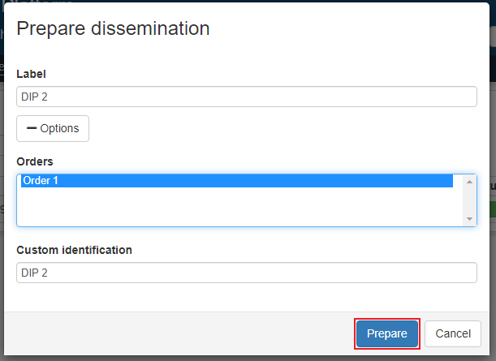
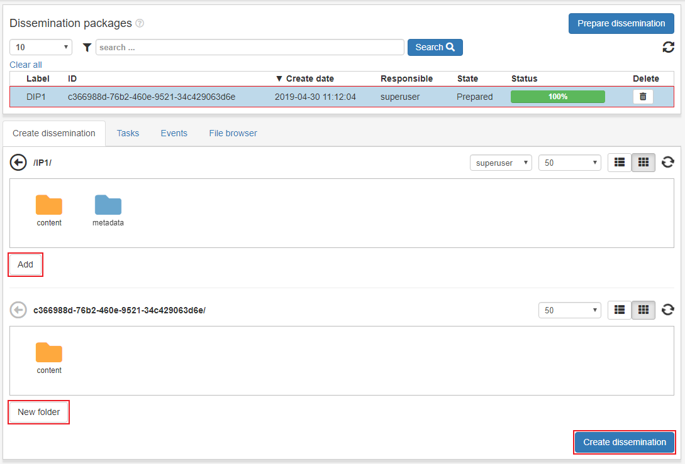

.. _dissemination:

*************
Dissemination
*************

The purpose of the Dissemination page is creating disseminations (or DIP).
The content of every IP in each users personal workspace
with state **Access Workarea** is available in the dissemination page
and can be used to create a dissemination.
A dissemination package is an information package for providing archived
material to a customer, also called dissemination information package (DIP).

First step is to prepare dissemination, so click **Prepare dissemination**.
Enter the required field label, optionally enter a custom
identification value and connect dissemination to an existing order.
Then click **Prepare** and the dissemination package is prepared.

Click the DIP row in the list view and two filebrowsers will appear.
The first represents data in the current users personal workspace which
can be marked and added to the second filebrowser window by clicking **Add**.
The user can also create new folders in the DIP and remove added files/folders.

With the right permissions a user can see content in other users workspaces by
selecting user in the user dropdown in the toolbar of the first filebrowser.

When satisfied with dissemination click the **Create dissemination** button.

