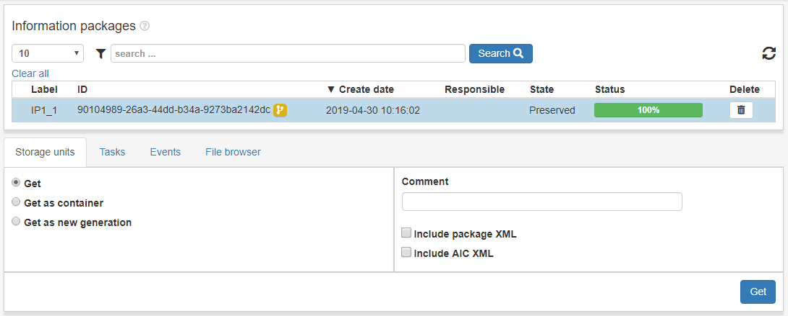
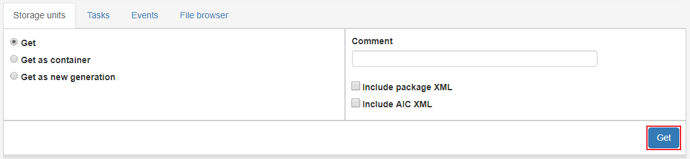

.. _storage-units:

*************
Storage units
*************

Access/storage-units is where all **preserved** AIPs are listed.
We can see information such as events and steps/tasks of the preserved AIP.

When clicking a row in the Access list view the user can make request from
a request form. The available requests in Access are explained below.

Get
---
Access AIP in archival storage to the Workspace with
content extracted as read only.

Choose the option **Get** and click **Get**. The AIP generation should
appear in the Access workspace shortly, the progress can be followed
in the status bar of the IP and in the
:ref:`State view <state-view>` for more detailed information.

Get as container
----------------
Access AIP in archival storage to the Workspace as
a tar or zip file.

Choose the option **Get as container** and click **Get**. The AIP
generation should appear in the workspace shortly,
the progress can be followed in the status bar of the IP and in the
:ref:`State view <state-view>` for more detailed information.

.. image:: images/access_request_form_get_as_container.png

Get as new generation
---------------------
Access AIP in archival storage to the Workspace as a
new generation of the AIP.
The new IP is basically a whole new IP but it is still related to the
family of IPs that are related to the same AIC.

Choose the option **Get as new generation** and click **Get**. The AIP generation should
appear in the Access workspace shortly, the progress can be followed
in the status bar of the IP and in the
:ref:`State view <state-view>` for more detailed information.

