#####################
Accession Records
#####################

Accession records store information about the receipt of materials to the archive.
Accession records tell you what material that was received, who it was received from, when it was received, and what resource(s)/collection(s) the material will be dispersed into.
ESSArchs accession management is designed to be used with different levels of complexity when describing accessions ranging from a simple logging of events to transfer management with linking to resource(s)/collection(s).

Adding new accession records
============================

Accession records are located under the accession tab in ESSArchs archival description section.

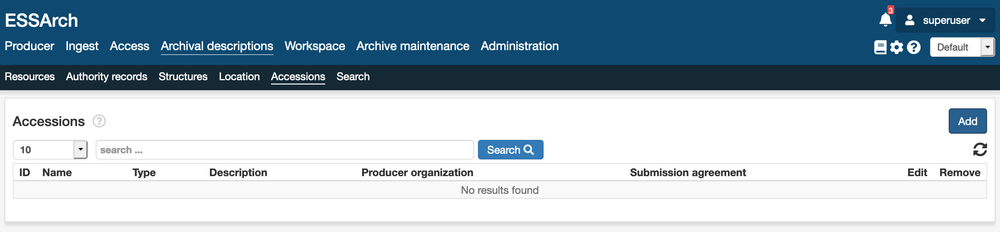

Basic accession information
___________________________

The Basic Information section of an ESSArch accession record helps archivists document the new acquisitions and also record key details about the nature and scope of materials.
ESSArch will automatically generate a numeric identifier when a new accession is created; it is an automatic increment of 1. This identifier, which is the Accession ID, is used to track accessions and is also employed in preservation workflows.

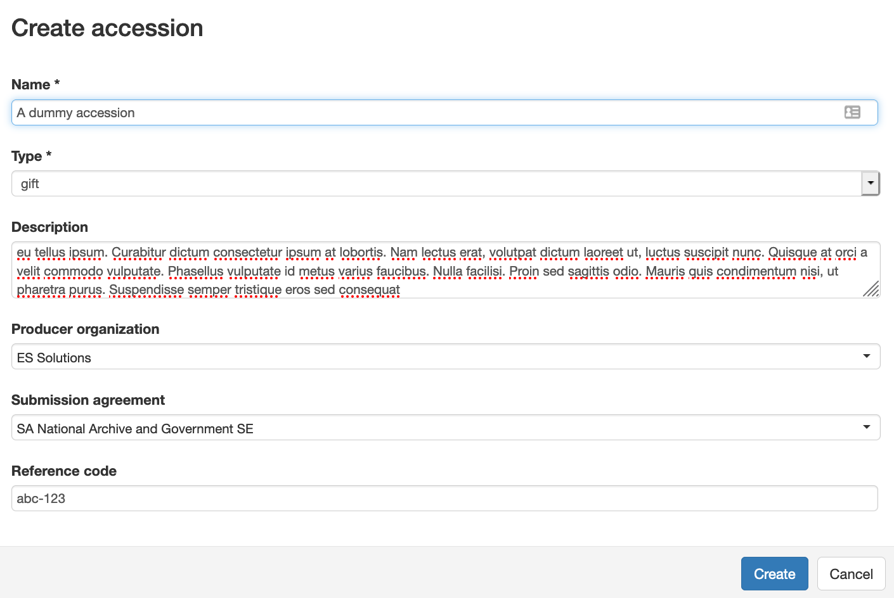

+-----------------------+--------------------------------------------------------------------------------------------------------------------------------------------------------------+
| Field                 | Description                                                                                                                                                  |
+=======================+==============================================================================================================================================================+
| Name                  | The name of the accession                                                                                                                                    |
+-----------------------+--------------------------------------------------------------------------------------------------------------------------------------------------------------+
| Acquisition Type      | A general term for the means by which Archives came to have custody of the accessioned materials.                                                            |
+-----------------------+--------------------------------------------------------------------------------------------------------------------------------------------------------------+
| Description           | A description of the materials contained within the accession. Can include information about physical condition, inventory, disposition and provenance etc.  |
+-----------------------+--------------------------------------------------------------------------------------------------------------------------------------------------------------+
| Producer organization | Links to an authority record that is responsible in some way for the accession's creation or custody transfer to the archive.                                |
+-----------------------+--------------------------------------------------------------------------------------------------------------------------------------------------------------+
| Submission agreement  | Link to a specific submission agreement that regulates the custody transfer to the archive                                                                   |
+-----------------------+--------------------------------------------------------------------------------------------------------------------------------------------------------------+
| Reference code        | Can be used for external reference or as a custom accession number                                                                                           |
+-----------------------+--------------------------------------------------------------------------------------------------------------------------------------------------------------+

Accession Events
================

ESSArch utilizes provenance events for logging the accession process. The events follow the same syntax and logic as for the rest of ESSArch and can also be employed in preservation workflows.
When a new accession record is added an registered event is automatically created.

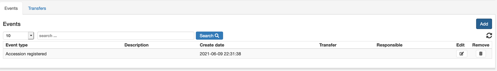

Adding events
_____________
By clicking the add button new events can be appended to the accession record

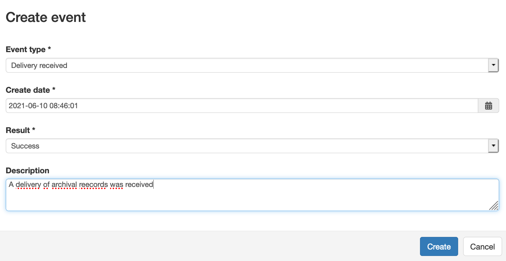

Event Types
_____________

The following event types is available from a standard installation of ESSArch.
Event types can be edited and new types can be added through ESSArchs administration interface.

+----------------------------------------------------+------------+
| Event                                              | Event Code |
+====================================================+============+
| Accession registered                               | 20300      |
+----------------------------------------------------+------------+
| Delivery received                                  | 20100      |
+----------------------------------------------------+------------+
| Delivery registered in journal system              | 20310      |
+----------------------------------------------------+------------+
| Delivery registered in archival information system | 20320      |
+----------------------------------------------------+------------+
| Delivery receipt sent                              | 20400      |
+----------------------------------------------------+------------+
| Delivery ready for hand over                       | 20500      |
+----------------------------------------------------+------------+
| Delivery transferred                               | 20600      |
+----------------------------------------------------+------------+
| Delivery approved                                  | 20700      |
+----------------------------------------------------+------------+
| Delivery rejected                                  | 20800      |
+----------------------------------------------------+------------+
| Delivery checked                                   | 20200      |
+----------------------------------------------------+------------+

.. warning::
  Be careful when updating Event types!
  Some event types have dependecies to preservation workflows that might break
  if event codes are changed.

Adding transfers
================

Accession records can also include information about physical transfer of material to the archive.
Transfers are sub records to an accession records which holds their own set of events.
This is very useful for keeping track of acquisition that have multiple transfer sessions
or from different actors. e.g. a digital registry might be transfered at one point in time by one actor (service provider),
the physical records described by the registry might be located, and hence transfered by yet another actor.

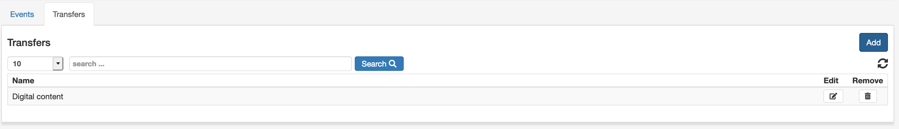

To add a new accession record hit the add button and fill in the basic information, there is also optional fields for
recording information about the submitter (Organization/Individual).

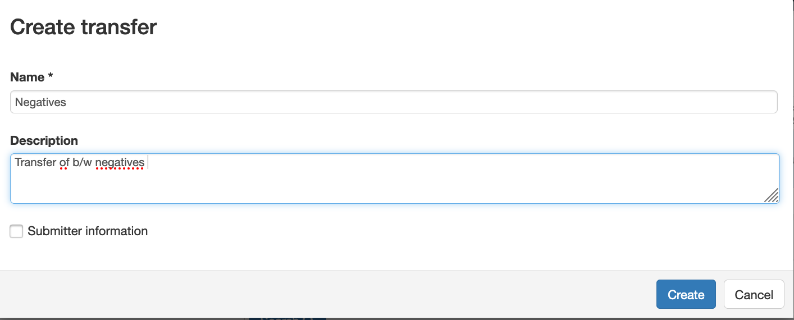

After the creation of the transfer record, transfer specific events can be created to track the transfer process.

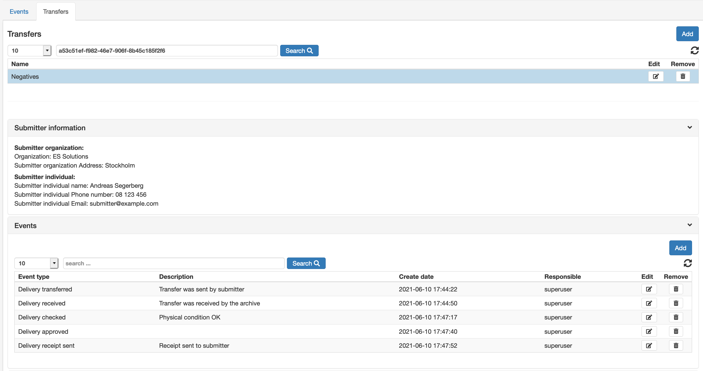

An overview of all events both the ones that refer to the accession record it self and all transfer records, is available under the event tab

Linking resources
=================

The linking of materials to a specific transfer is managed through Archival descriptions and
is done either by selecting multiple containers in the archival description tree and clicking the shortcut button "Link to transfer".

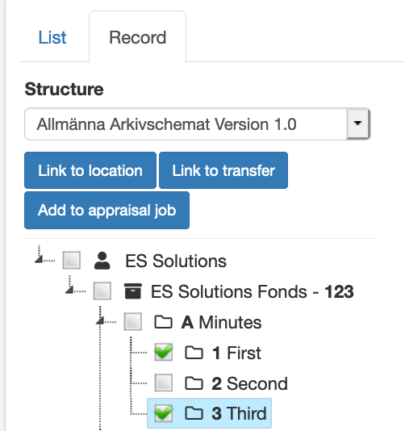

The Linking can also be done by right clicking a container in the tree and select "Link to transfer"

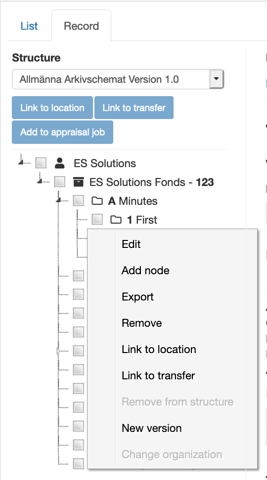

Select the desired accession and transfer records and click "save"

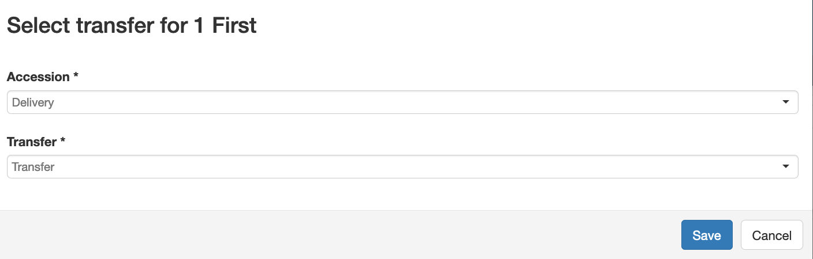

The linked containers are now accessible from the transfer record.

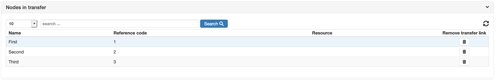
