###############################
Archival Descriptions
###############################
Archival Descriptions identifies and explains the context and content of archival materials in order to promote its accessibility.
ESSArch adheres to `ISAD (G), 2nd Edition <https://www.ica.org/sites/default/files/CBPS_2000_Guidelines_ISAD%28G%29_Second-edition_EN.pdf>`_ and comes with a standard set of controlled vocabularies for typed fields which can be customized or supplemented by additional values.
Archival descriptions are created and controlled separately from authority records in ESSArch and are associated by linking.

Structures
==========
Structures are a basis for the arrangement, classification and description of records and can in  be filing plans, business process classifications description of functions or basically any other classification system that can be represented as either a flat
or a tree hierarchy structure.

Structures in ESSArch largely based upon `ISDF 1st edition <https://www.ica.org/sites/default/files/CBPS_2007_Guidelines_ISDF_First-edition_EN.pdf>`_
For a detailed crosswalk between ESSArch and ISDF please see the :ref:`ICA Standards <ICA_Standards>` section.

Adding new structure types
__________________________
New structure types are added through ESSArch's administration interface.

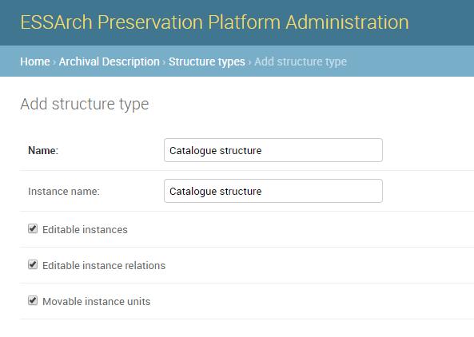

A structure type can be configured to either allow or disallow:

* Editable instances of a template
* Editable relations (to other levels or structures) of a template
* Movable instance units (nodes in a tree) of a template

Adding new Structure Unit Types
________________________________
Structure units are the levels of classification and description within a given structure and are added to a
structure type through ESSArch's administration interface.

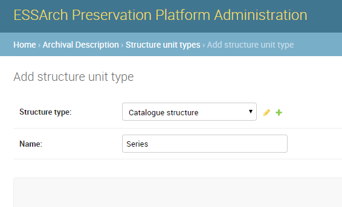

two different structure types with example structure units (levels).

+--------------------------------+-------------------+
| **Structure Type**             | **Structure Unit**|
+--------------------------------+-------------------+
| Business Classification Scheme | Transaction       |
+--------------------------------+-------------------+
| Business Classification Scheme | Activity          |
+--------------------------------+-------------------+
| Business Classification Scheme | Function          |
+--------------------------------+-------------------+
| Catalogue structure            | Series            |
+--------------------------------+-------------------+
| Catalogue structure            | Sub-series        |
+--------------------------------+-------------------+
| Catalogue structure            | File              |
+--------------------------------+-------------------+

Adding new Structure
________________________________
Structures (template) are administrated under the structure section of ESSArch.

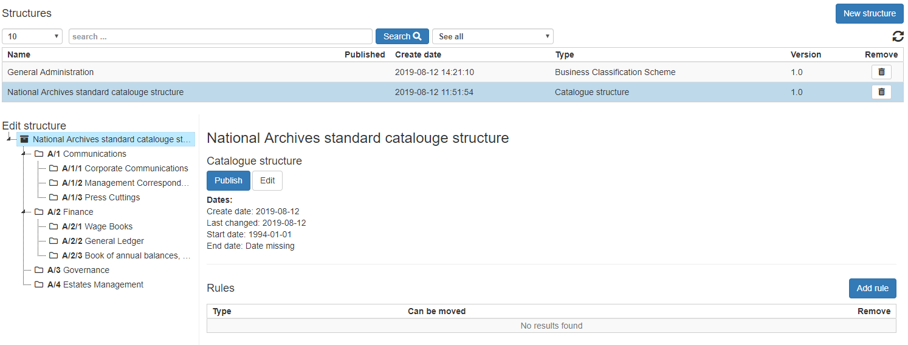

To add a new structure, click the new structure button .

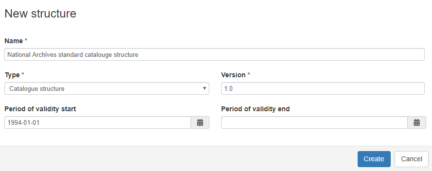

Adding Structure units
______________________
Structure units are added to a structure by right clicking on a node in the tree.

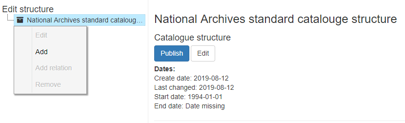

Adding relationships to other Structures / Structure units
___________________________________________________________
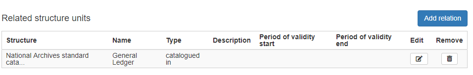

Publish
_______
When a Structure has been published it becomes available for use through out ESSArch.

Top-level Resources
===================
All resources described in ESSArch need to have a top-level resource.
Intellectually this can represent the archival descriptions on the fonds or collections level.

There are no limitations of the types of top-level resources that can be used in ESSArch. One institution might settle
with just one top-level whilst another has a need for distinguish different types of archives or collections.

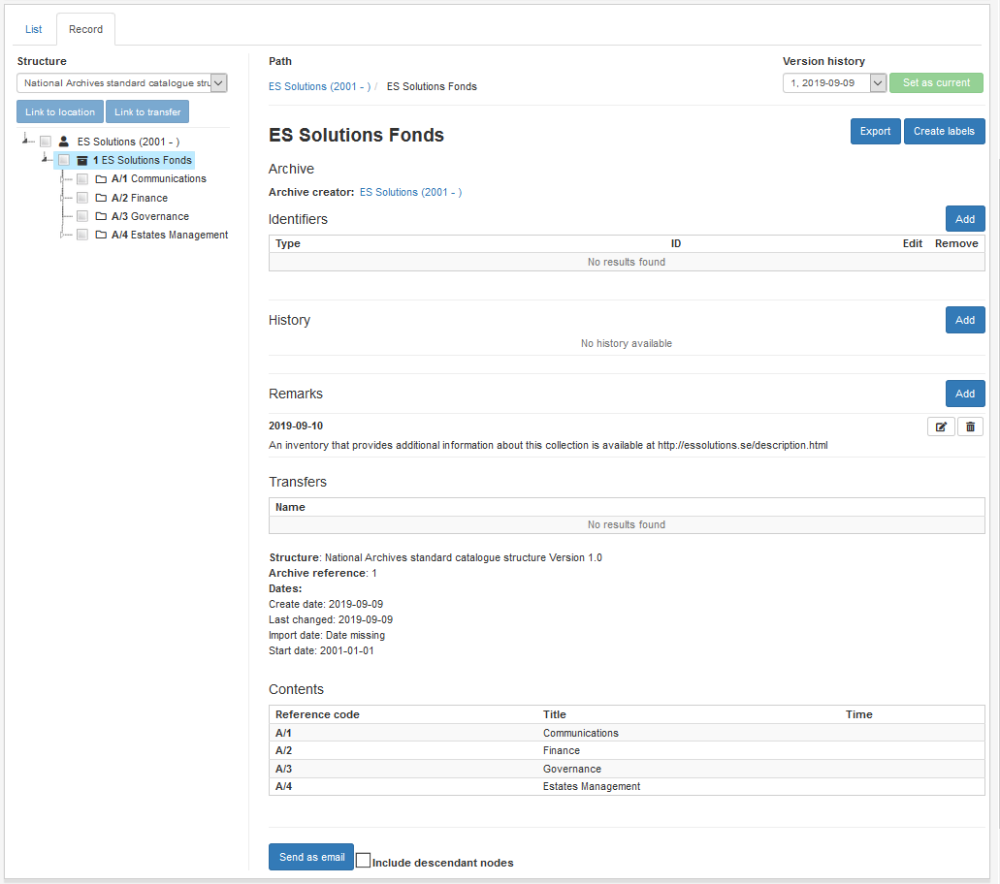

Adding a new top-level resource
________________________________
Under the resource tab click on the "new resource" button. From the structures field choose one or more structures that will act as a template
for the the top-level resource it self and underlying resource descriptions defined in the structure.

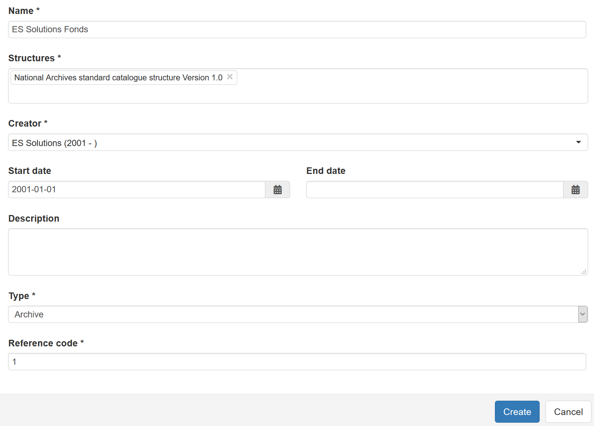

When initially creating an top-level resource record the following fields are required:

* Name (ISAD-G Title)
* Structures
* Creator
* Type
* Reference code

Adding new structure units
__________________________
Structure units are the levels of classification and description within a given structure.
If the user has the right permissions new structure units can be added to an instance (top-level resource) of a structure.

To add a new structure unit, right click on the tree node and select "add structure unit"

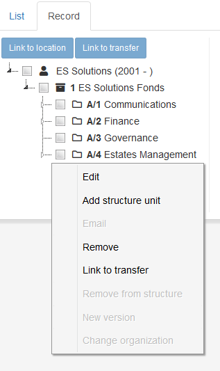

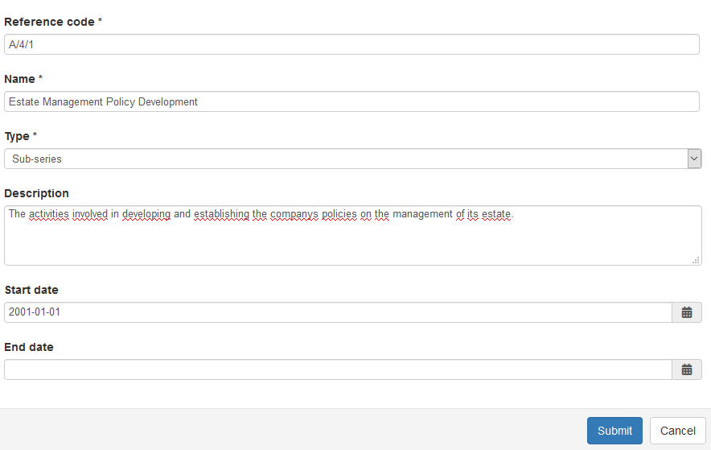

Adding nodes
____________
Nodes can be described as something with a physical representation within a logical structure, something that can be moved around.
e.g. analogue information packages archival boxes, other containers as well as digital information packages (AIP) and items contained in these packages.

Nodes are added under structure units by right clicking on a structure unit in the tree and select "add node".

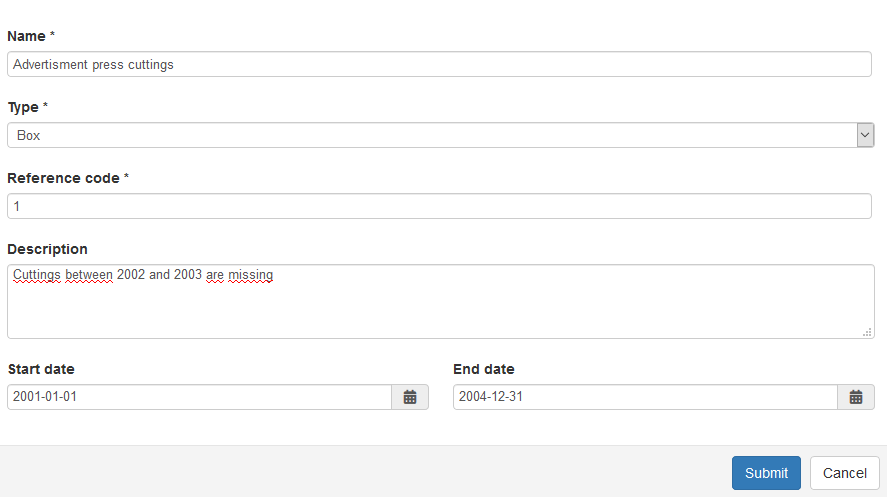

When a structure unit is selected in the tree, an overview of the contents is displayed.

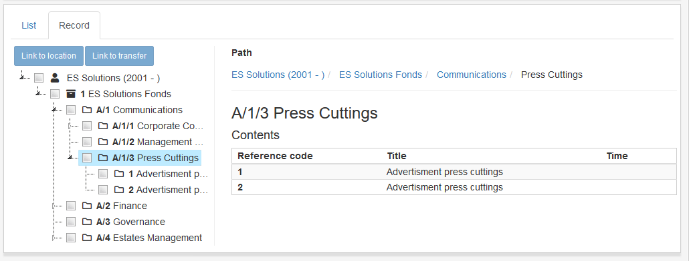

Adding descriptive texts and notes
___________________________________________
In ESSArch one can have multiple descriptive texts / notes for resource records

Standard type of notes that can be used in ESSArch:

* Archival history
* Administrative / Biographical history
* Immediate source of acquisition or transfer
* Appraisal
* Destruction
* Scheduling
* Accruals
* System of arrangement
* Physical characteristics
* Finding aid
* Publication note
* Archivist's note

To add a new descriptive text click on the History or Remarks tab and then the add button.

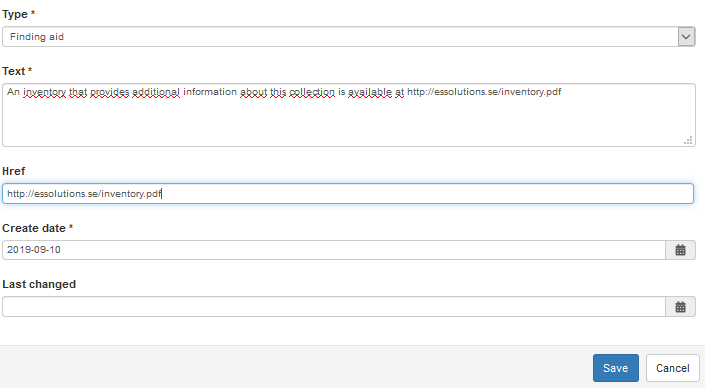
