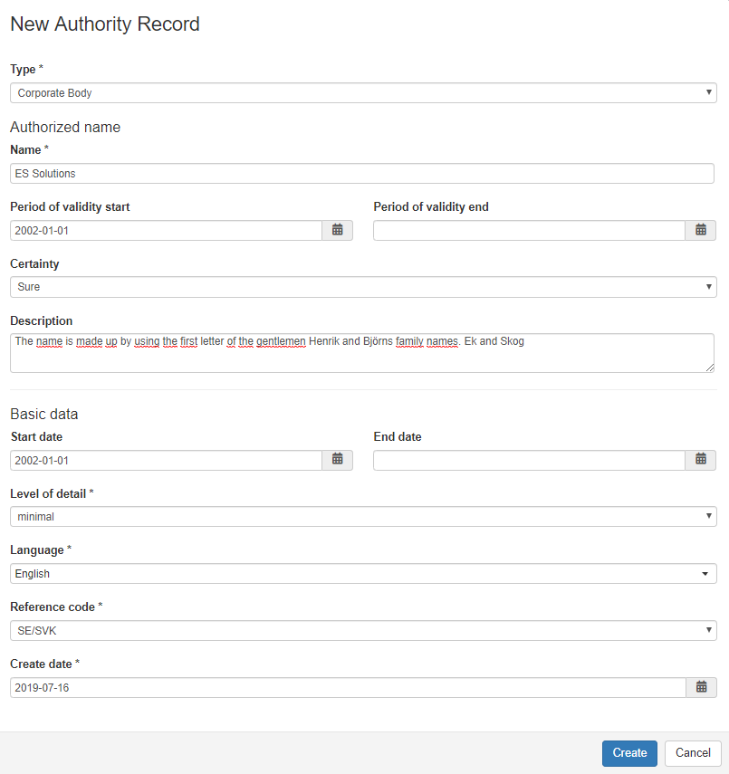
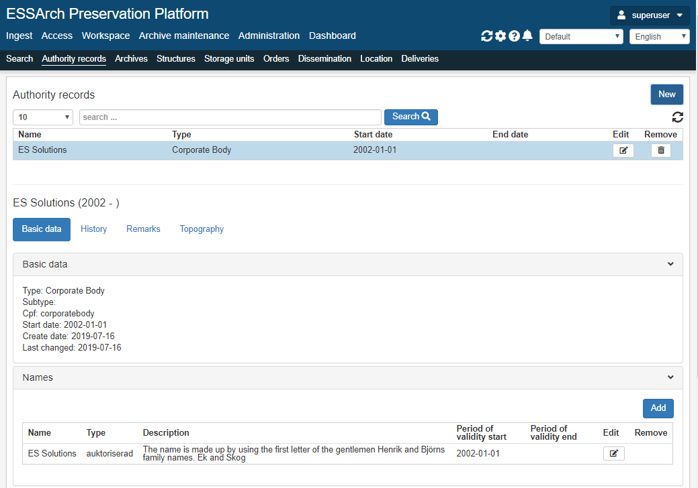
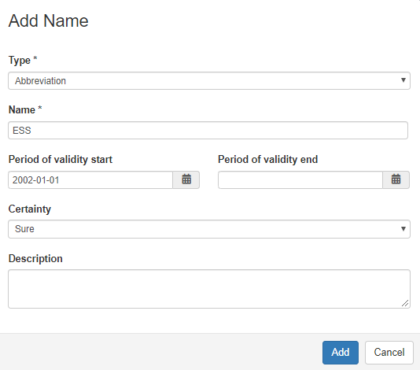
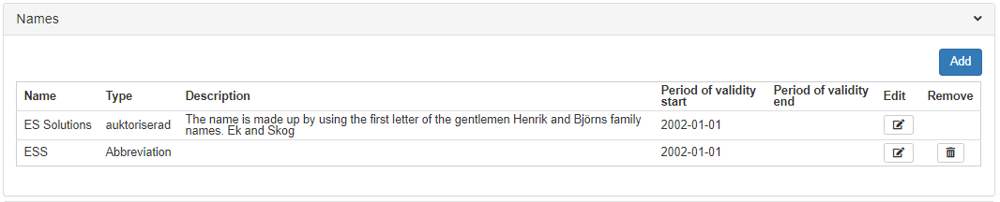
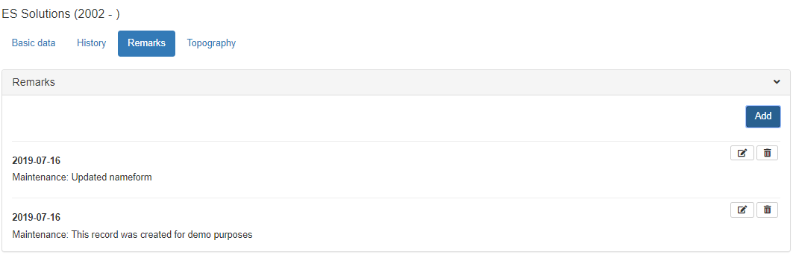
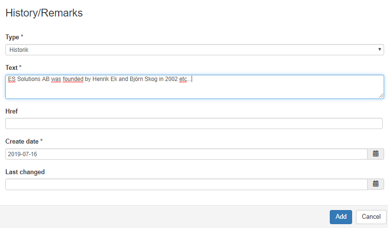
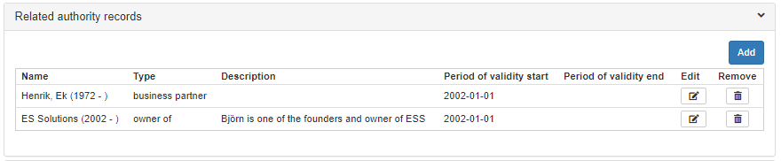

#################
Authority records
#################
Describes corporate bodies, persons or families that are associated with the creation and maintenance of
archives, such as creator, donor or custodian.

ESSArch adheres to `ISAAR (CPF), 2nd Edition <https://www.ica.org/sites/default/files/CBPS_Guidelines_ISAAR_Second-edition_EN.pdf>`_ and comes with a standard set of controlled vocabularies for typed fields which can be customized or supplemented by additional values.

Authority Records are created and controlled separately from archival (resource) descriptions in ESSArch and are associated by linking.

By default there is three main types of Authority records in ESSArch:

* Person
* Family
* Corporate Body

These three main types can be further `subdivided <Create custom vocabularies>`_ by the organization needs or other requirements of subdivision i.e.

* Corporate body - State agency
* Family - Royal Family

The :ref:`ICA Standards <ICA_Standards>` section provides a detailed documentation of the entry fields of an authority record in ESSArch, their relation to ISAAR-CPF and default values available from a standard installation.

Creating and managing authority records
=======================================
.. warning::
  Be careful when updating Authority records!
  Updating of an Authority record changes it for every link to the referenced record.

Creating a new authority record
_______________________________

A new authority record can be created by clicking the new button under the authority record section of ESSArch.

When initially creating an authority record the following fields are required for all types of authority records:

* Type
* Name (Authorized form)
* Language
* Reference code (institutional code)
* Create date (Auto populated)

    New authority record form

.. note::
   For Authority records of type person the name field is automatically separated into  Firstname and Lastname fields.

   Detail view of newly created authority record

Adding other name forms
_______________________

By clicking the add button in the names subsection one can record additional name forms.
i.e. Parallel forms of name, Standardized forms of name according to other rules and Other forms of name.

After the additional name form has been saved the record is available under the Names section.

Adding history, descriptive texts and notes
___________________________________________
In ESSArch one can have multiple descriptive texts / notes.

.. warning::
  Custom note types will in future EAC exports be exported as <maintenanceEvent>  !

Standard type of notes that can be used in ESSArch:

* Biography/History
* Maintenance
* Internal structures
* Genealogy
* General context

To add a new descriptive text click on the History or Remarks tab and then the add button.

From the dropdown menu choose the appropriate note type, add text and click add to save.

Creating relations
___________________

Relationships with other corporate bodies, persons and families can be described by linking authority records.

Relationship types in ESSArch are mirrored which means that if a relation is created on one authority record the relation will automatically be mirrored when viewing the referenced authority record.

+------------------+------------------+
| **Type**         | **Mirrored Type**|
+------------------+------------------+
| business partner | business partner |
+------------------+------------------+
| successor        | predecessor      |
+------------------+------------------+
| predecessor      | successor        |
+------------------+------------------+
| owned by         | owner of         |
+------------------+------------------+
| owner of         | owned by         |
+------------------+------------------+
| controlling      | controlled       |
+------------------+------------------+
| controlled       | controlling      |
+------------------+------------------+
| subordinate      | superior         |
+------------------+------------------+
| superior         | subordinate      |
+------------------+------------------+

To add a relation from one authority record to another click the add button in the related authority records section.

