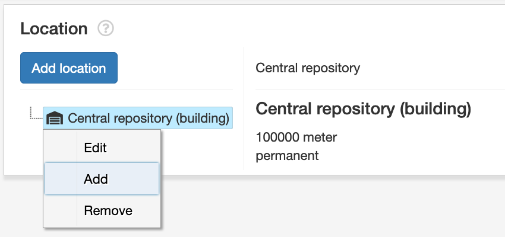

#####################
Location Records
#####################
Location records can describe any storage location; buildings, rooms shelves, file cabinets, etc. Location records are designed to track both the permanent and temporary locations of materials.

Location records are intended for physical spaces and not storage of digital AIP's / files.
Locations for AIP's are managed via Administration/Media Information / Storage mediums

Creating and managing location records
======================================
Locations are managed in the location section of ESSArchs Archival Description Management section.

Creating a new top location record
__________________________________
To create a new top location, click the "Add Location" button and fill in the form

Description of form fields

+----------+-----------------------------------------------------------------------------------------------------------------------+
| Name     | The name used for the location. Either a arbitrary string value like "Central Repository" or an identifier like 1.2.7 |
+----------+-----------------------------------------------------------------------------------------------------------------------+
| Metric   | The metric value used to describe capacity                                                                            |
+----------+-----------------------------------------------------------------------------------------------------------------------+
| Capacity | An Integear value of the locations total capacity                                                                     |
+----------+-----------------------------------------------------------------------------------------------------------------------+
| Level    | The level (type) of location, e.g. bulding, floor, room, cabinet etc.                                                 |
+----------+-----------------------------------------------------------------------------------------------------------------------+
| Function | The locations function e.g permanent for archival storage and temporary for reading rooms                             |
+----------+-----------------------------------------------------------------------------------------------------------------------+

Adding sub locations
____________________
A top level location can have an unlimited set of nested childrens. To add a new sub location right click a node in the location tree and select "Add" and fill in the form.

Linking containers (boxes) to locations
_______________________________________
The linking of materials to a specific location is managed through a specific Archival description.
You can either select multiple containers by checkboxes in the archival description tree and clicking the shortcut button "Link to location".

.. figure:: images/locations/checkbox_tree_location.png
    :width: 251px
    :height: 267px
    :alt: Checkbox selection i tree

The Linking can also be done by right clicking a container in the tree and select "Link to location"

.. figure:: images/locations/tree_location_right_click.png
    :width: 270px
    :height: 484px
    :alt: Right click to select location

In the modal form, select the desired location in the tree and hit select to save the location link

The linked location is now visible from the containers detail view. The locations detail view shows all containers registred.

Moving containers to a new location
___________________________________
Containers can be moved between locations by selecting the containers in the table of the locations detail view and hitting the "Link to new location" button.
By holding down shift button while clicking enables you to select multiple containers to be moved.

Managing vocabularies
_____________________
The vocabularies used for location levels, functions and metric types can be managed through ESSArchs Administration interface.

