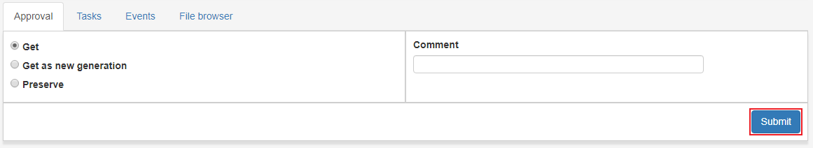
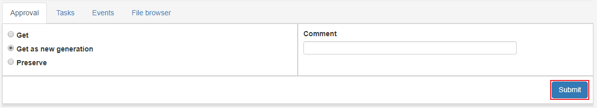

.. _approval:

*********
Approval
*********

Before an AIP can be preserved it has to be approved.

When clicking on an AIP in the Approval list we see
a request form for applying actions on an AIP.
There are a couple of different types of request which are explained below

.. image:: images/request_form_approval.png

.. _approval-requests:

Preserve
--------

Preserve AIP to archival storage according to information from profiles.

Choose **Preserve**, and click **Submit** to start the
preservation process.
The progress can be followed in the status bar of the IP and in the
:ref:`State view <state-view>` for more detailed information.

.. image:: images/request_form_preserve.png

Get
---

Get AIP to Ingest Workspace as `read only`.
This means that the IP in the workspace can not be changed, only "read".

Choose **Get**, and click **Submit**.
The AIP will appear in the workspace shortly.
The progress can be followed in the status bar of the IP and in the
:ref:`State view <state-view>` for more detailed information.

Get as new generation
---------------------

Get IP to Ingest Workspace as a new generation of IP.
The new IP is basically a whole new IP but it is still related to the
family of IPs that are related to the same AIC.

Choose the option **Get as new generation**, and click **Submit**.
The AIP generation should appear in the ingest workspace shortly,
the progress can be followed in the status bar of the IP and in the
:ref:`State view <state-view>` for more detailed information.

