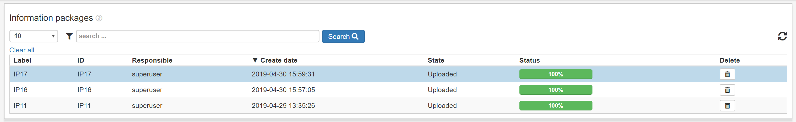
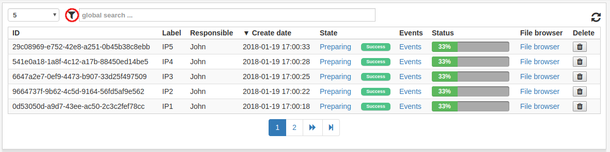
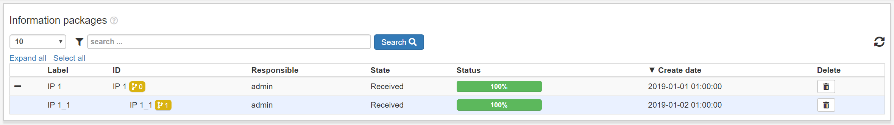

.. _list-view:

List view
=========

The list view is the table of objects that is present in most views in ESSArch.
The objects listed in this view are always relevant to the current view, and
filtered depending on state and permissions and provided are additional
optional filter and sorting options.

The list view can be filtered by clicking the filter icon, which opens
a menu with all available filters.

In ESSArch Preservation Platform (EPP) many list views includes nested IPs
which can be expanded to see the underlying IPs. What should appear in the
first level can be administrated in the :ref:`user settings
<user-settings-ip-view-type>`.

The available functions of a view, like browsing files, jobs or events, and
main functionality like IP preparation, creation and preservation, is accessed
by clicking on a row in the IP list and selecting the corresponding tab. In
many cases, a user can select multiple rows by holding the :kbd:`CTRL` key and
click each item or click the first item, hold the :kbd:`SHIFT` key and
click another to select all IPs between including the two selected. Selecting
multiple items may reduce amount of actions that can be done, since
any action taken will be done to all selected objects.
