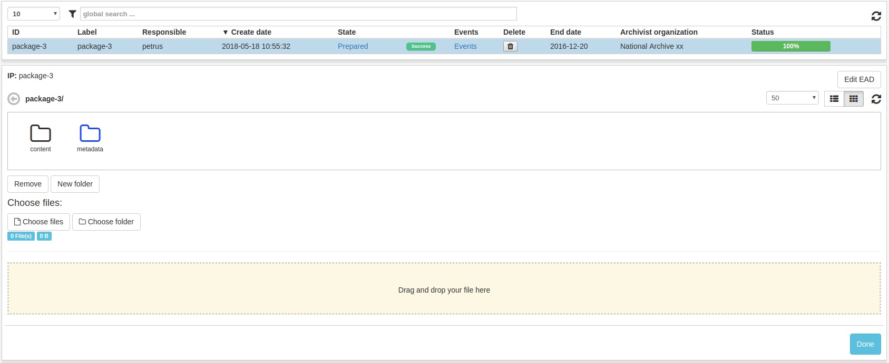
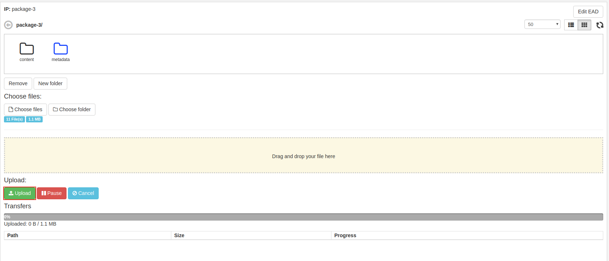
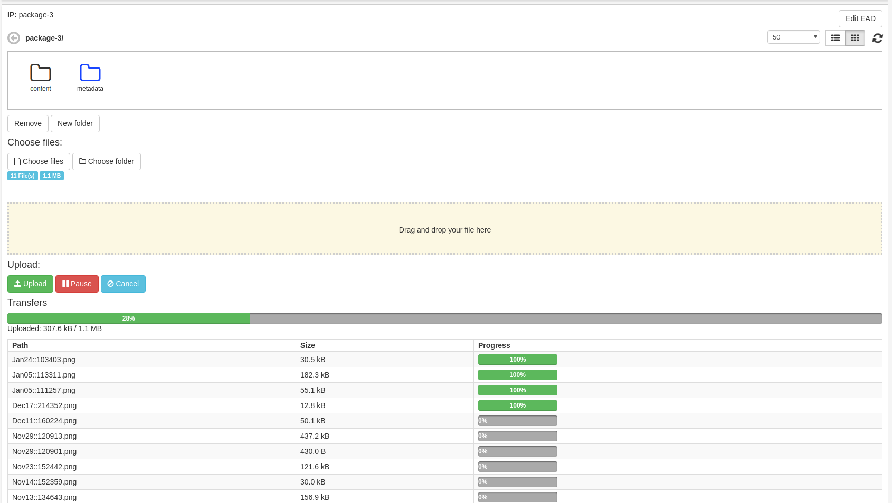
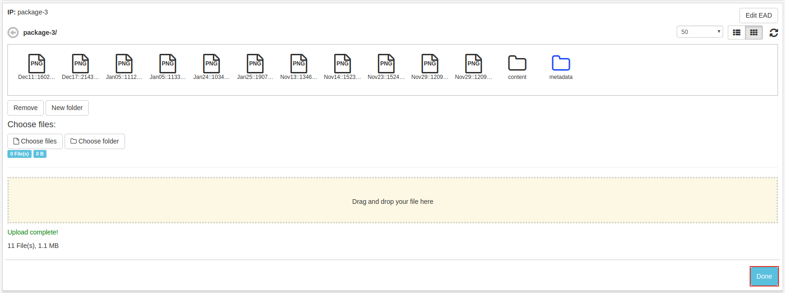

.. _collect-content:

******************
 Collect content
******************

Once the IP is prepared, the ip is visible in the
Collect content list view.

Upload
======

The user may upload single files or folders by navigating
to preferred location in the file browser and clicking upload or
by dragging the file(s) from a folder to the drop are and drop them.

It is important to not close the application while uploading content.

The file browser also has functionality for deleting
files/folders and adding new folders.
These functions can be executed through buttons beneath the
file browser window.

.. image:: images/collect_delete_add_folders.png

To start uploading selected files click **Upload**.

When upload is considered done, click **Done**.
The IP can then be found in the Create SIP list view.

Folder upload may not be supported by older browsers.
If functionality is desired please update your browser.
