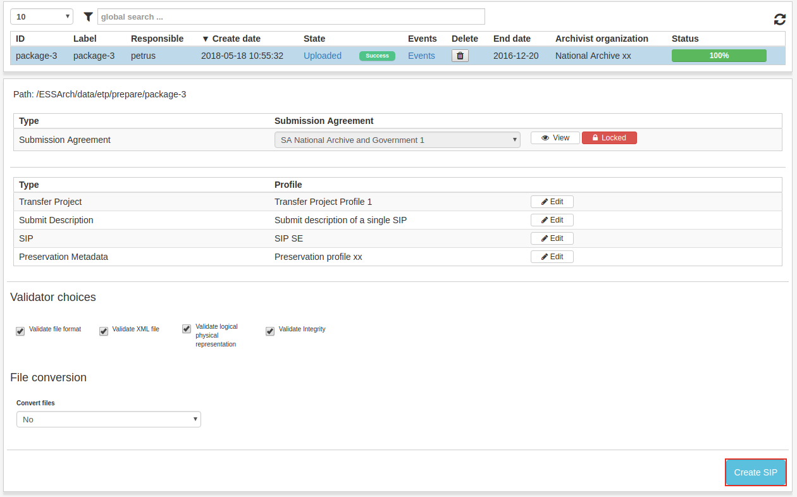

.. _create-sip:

****************
 Create SIP
****************

When upload is set completed the ip becomes visible in the
Create SIP view.

The user can, by clicking the IP row inspect all included
profiles and edit them, with the right permissions (see :ref:`Profile editor <prepare-ip-profile-editor>`).

If satisfied with the profiles, choose what validators to use in the
SIP creation step by checking or unchecking the different validators,
click **Create SIP** to create.

