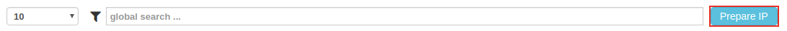
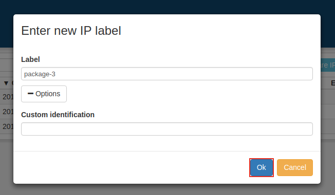
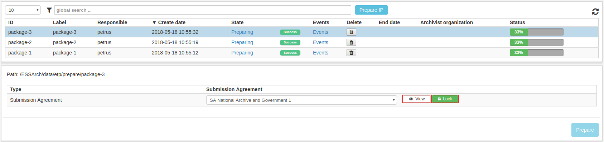
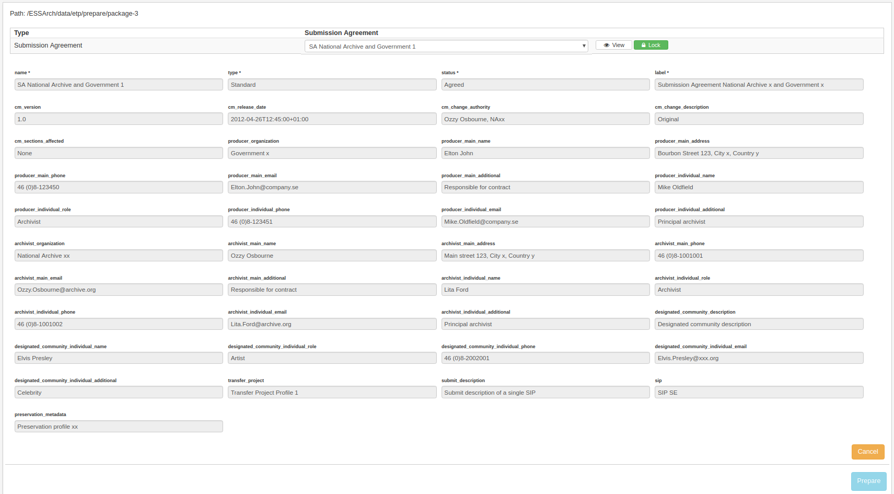
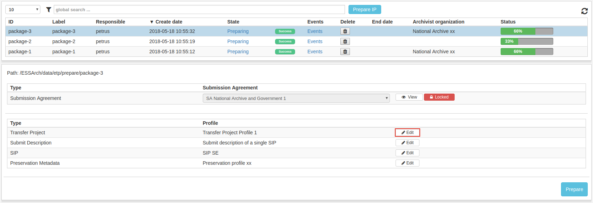
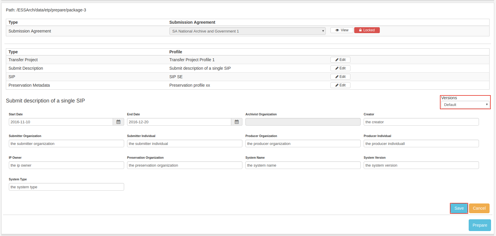
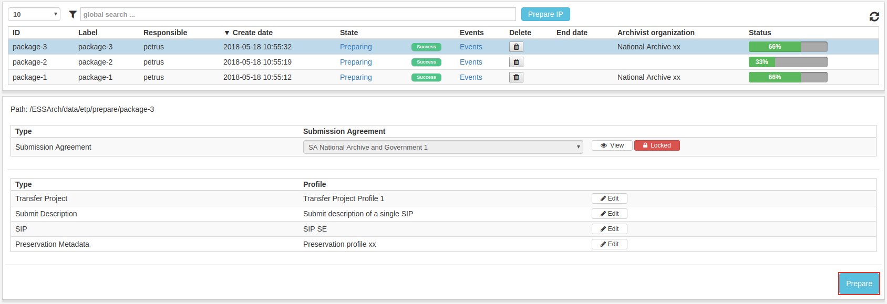

.. _prepare-ip:

******************
 Prepare IP
******************

The first step in the process of SIP creation is Prepare IP,
IPs That are not yet **Prepared** are listed in the Prepare IP
list view.

Prepare
=======

The prepare process is started by clicking the **Prepare IP** button.

The user is then asked to type a label for the new IP and can optionally
enter a custom identifier value.

.. _prepare-ip-profile-editor:

Profile editor
==============

When clicking the IP row in the list view, the user can chose which Submission
Agreement(SA)-profile to use.
The Submission Agreement fields can be viewed by clicking the
**View** button next to the SA-select. When the user is satisfied,
he/she locks it by clicking the lock button.

After Submission agreement is locked, the profiles can be viewed and edited.

The user can edit profiles by clicking the **Edit** button in the profile table
which will allow the user to edit the data of the profile fields
for that specific profile. When done, click **save** and a
new version of the profile data will be saved and made the current version.

The user can use the **Versions**-dropdown list to choose earlier or later
versions of the profile data.

If the user is satisfied with all profiles, the IP can be prepared
by clicking the **Prepare**-button in the bottom right corner.

When IP is Prepared it is no longer visible in the Prepare IP list view and
can be found in the Collect content list view.
