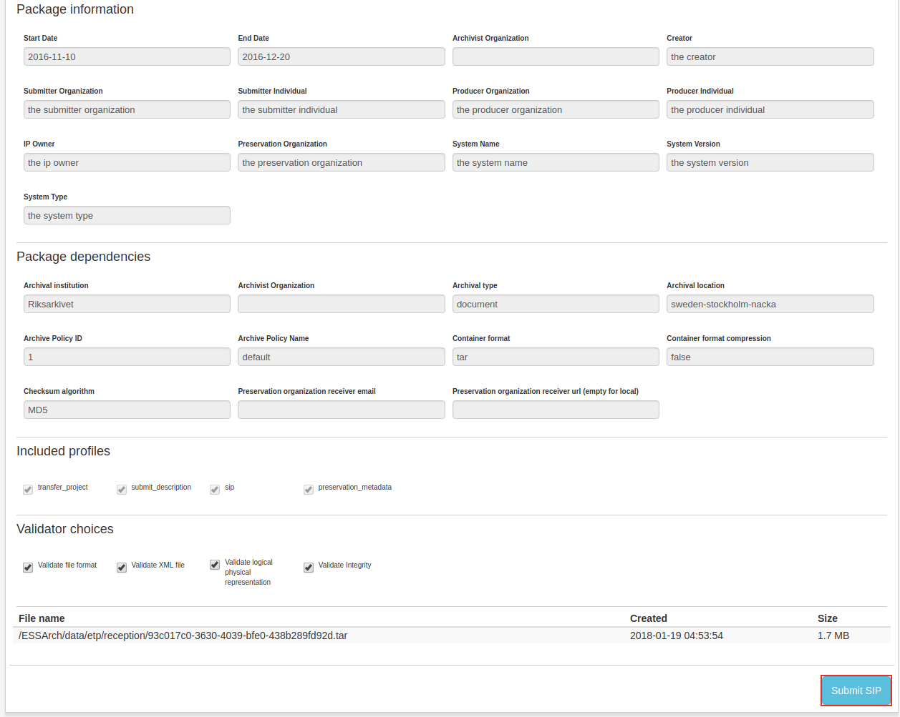

.. _submit-sip:

************
 Submit SIP
************
Once the SIP is created it becomes visible in the Submit SIP
view and is ready for submission.

By clicking the IP row, the user can see information that is
important for the SIP submission. Click **Submit SIP** to submit.

