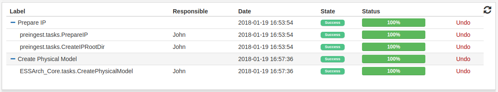
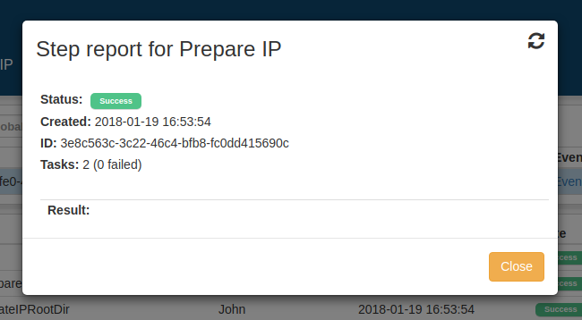
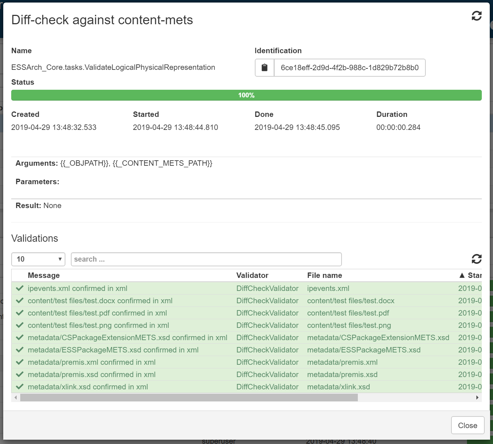
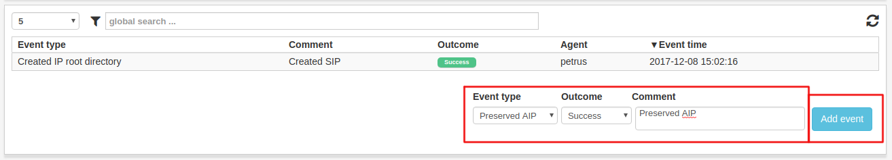
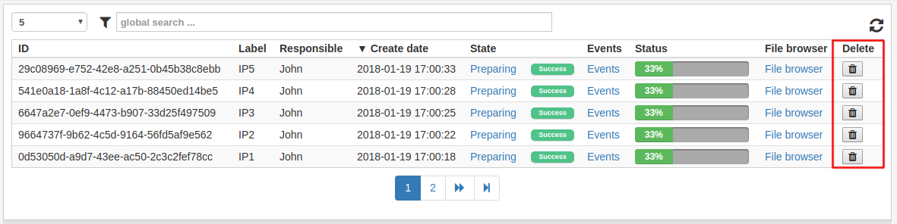
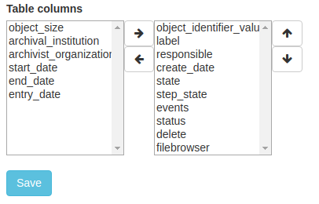
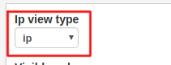

.. _user-interface:

****************
Interface
****************

.. _user-interface-list-view:

List view
=========

The list view is the table of objects that is present in most views in ESSArch.
The objects listed in this view are always relevant to the current view, and
filtered depending on state and permissions and provided are additional
optional filter and sorting options.

.. image:: images/list_view.png

The list view can be filtered by clicking the filter icon, which opens
a menu with all available filters.

.. image:: images/list_view_filter.png

In ESSArch Preservation Platform (EPP) many list views includes nested IPs
which can be expanded to see the underlying IPs. What should appear in the
first level can be administrated in the :ref:`user settings
<user-settings-ip-view-type>`.

.. image:: images/list_view_epp.png

The main functionality of a view, such as preparation, creation and
preservation, is accessed by clicking on a row in the IP list.

.. _user-interface-state-view:

State view
==========

Clicking the **State** column will show all steps and tasks for an IP. This view
has information about the progress and/or outcome of each step and task.

.. image:: images/list_view_state_column.png

Click on a step or a task to see more information. This is very useful if an
error occurs because the user can access a detailed description of the error
which will help when finding out where things went wrong.

.. _user-interface-events-view:

Events view
===========

Clicking the **Event**-column will show a list of all events for an IP.  A user can add
new events by filling out the fields and clicking **Add event**.

.. image:: images/list_view_events_column.png

.. _user-interface-delete-ip:

Delete IP
=========

A user with enough permissions can delete an IP by clicking the
**delete**-button.

.. _user-settings:

User settings
=============

User settings can be found by clicking the user symbol in the top right corner
and selecting "User settings".

.. image:: images/user_settings1.png

.. _user-settings-column-picker:

Column picker
-------------

The user can choose which columns should be shown in all the IP list views of
ESSArch and in which order they appear.

.. _user-settings-ip-view-type:

IP view type
------------

In ESSArch Preservation Platform (EPP) there is an additinal setting - **IP
view type** that allows the user to choose what to see in the IP list view.

 * IP - The first generation of each AIC with all other generations nested
 * AIC - The AIC with all generations nested

