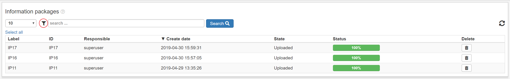
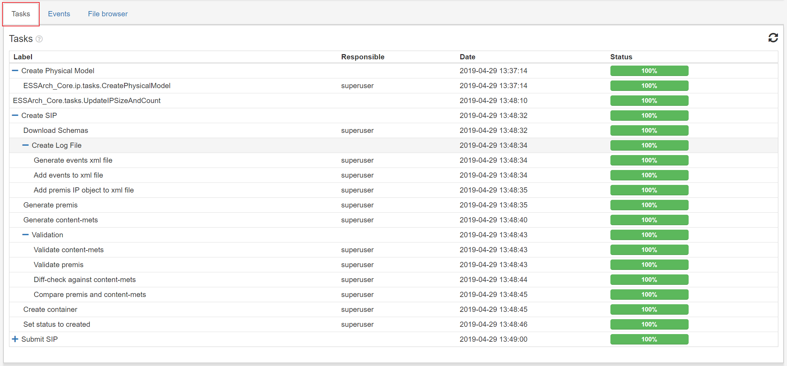
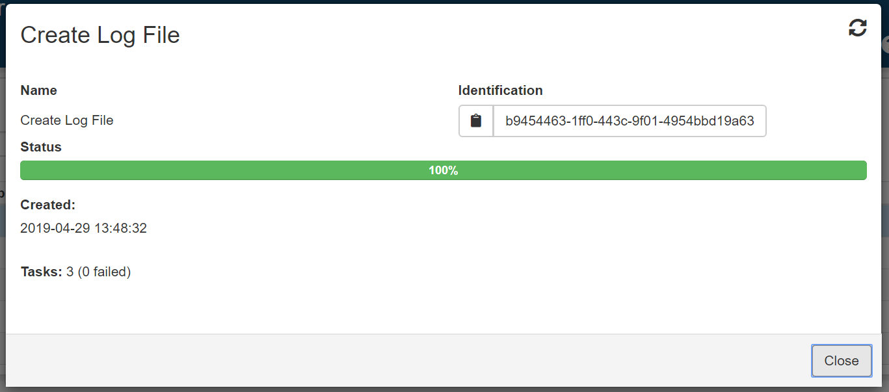
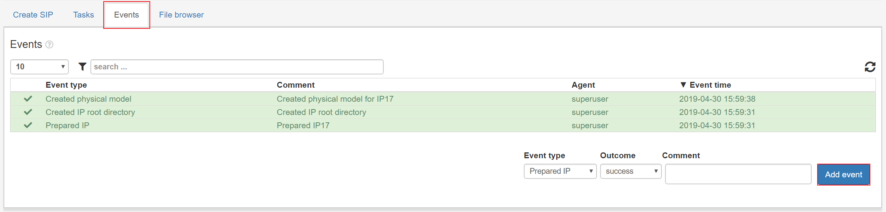
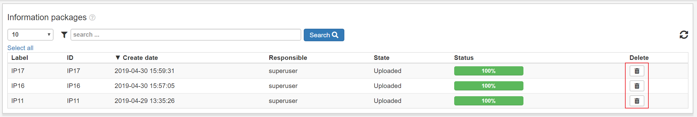
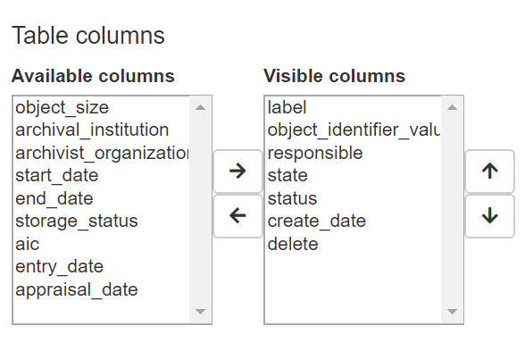

.. _user-interface:

****************
Interface
****************

.. _user-interface-list-view:

List view
=========

The so called list view is the table of
objects(Mostly IP's but there are some exceptions) that is present in Most
views in the ESSArch platform.
The IP's listed in this view are always relevant to the
current view, the deciding parameter is usually the **state** field
of the IP and in some cases, like in workaspaces etc, there are other aspects
that is taken into account aswell.

.. image:: images/list_view.png

The list view can be filtered by clicking the filter icon, which opens
a dropdown menu with all available filters like entry_date etc.

In ESSArch Preservation Platform(EPP) many list views has nested IPs
that can be expanded to see the underlying IPs. What should appear
in the first level can be administrated in :ref:`User settings <user-settings-ip-view-type>`

.. image:: images/list_view_epp.png

The list view has a couple of important functions built in which will
 be described below.
The main funcitonality of a view, such as Prepare IP, Workspace/validation
or Approval, is accessed by clicking the IP row, most columns can be clicked
to access the main functionality except a few columns that has
their own functionalities. What columns that should be visible can be
administrated at :ref:`User settings <user-settings-column-picker>`.
The special columns are described in the sections below
among other general interface functions.

.. _user-interface-state-view:

State view
==========

Clicking the state column will show all steps and tasks for an IP.
This view has information about task and step outcome, progress and sub
steps/tasks.

.. image:: images/list_view_state_column.png

Click on a step or a task to get a page with more information about the
step/task. This is very useful if a step/task fails because the user can
access an error traceback which will help
when trying to find out where things went wrong.

.. image:: images/task_report.png

.. _user-interface-events-view:

Events view
===========

The **Events**-column will show a list of all events for an IP.
A user can add new events by filling out the fields and clicking **Add event**.

.. image:: images/list_view_events_column.png

.. _user-interface-delete-ip:

Delete IP
=========

A user that has permissions to delete an IP can delete an IP by clicking
the **delete**-button.

.. _user-settings:

User settings
=============

User settings can be found by clicking the user
symbol in the top right corner and selecting "User settings".

.. image:: images/user_settings1.png

.. _user-settings-column-picker:

Column picker
-------------

The user can choose what columns should be shown in all the list
views of ESSArch and in which order they appear.
The columns are saved for each user, so the user "User" can have a
different set of columns from login than the user "Admin" and vice versa.
These settings are saved when clicking the "save" button and will always
be applied on the specific user.

.. _user-settings-ip-view-type:

IP view type
------------

In ESSArch Preservation Platform(EPP) User settings has another settings
called **Ip view type** that allows the user to choose what to see at
the first level in the list view IP row.

 * IP - see the first generation of an IP in the first level
 * AIC - see the AIC in the first level

.. image:: images/user_settings_view_type.png
