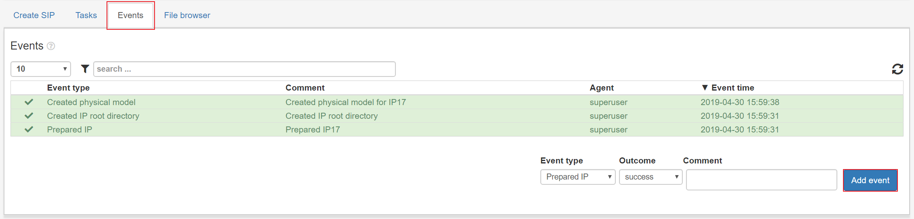

.. _events-view:

Events view
===========

Clicking the **Events** tab after selecting an IP will show a list of all
events for an IP.  A user can add new events by filling out the fields and
clicking **Add event**.

