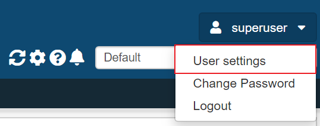

.. _user-settings:

User settings
=============

User settings can be found by clicking the user symbol in the top right corner
and selecting "User settings".

.. _user-settings-column-picker:

Column picker
-------------

The user can choose which columns should be shown in all the IP list views of
ESSArch and in which order they appear.

.. image:: images/user_settings_column_picker.png

.. _user-settings-ip-view-type:

IP view type
------------

In ESSArch Preservation Platform (EPP) there is an additinal setting - **IP
view type** that allows the user to choose what to see in the IP list view.

 * IP - The first generation of each AIC with all other generations nested
 * AIC - The AIC with all generations nested

.. image:: images/user_settings_view_type.png
