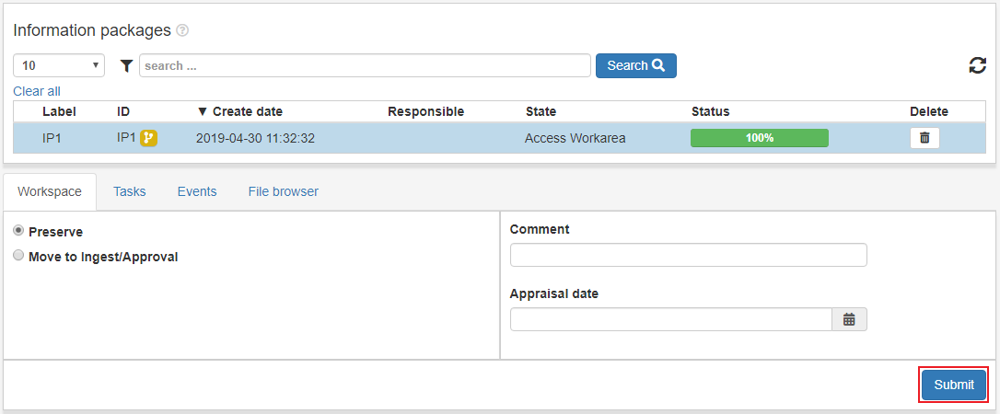
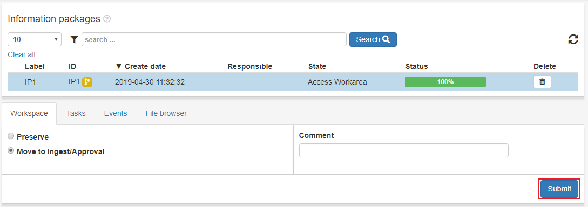

.. _workspace:

*********
Workspace
*********

The Workspace is where the user can modify IPs both in the user
interface and access the files to use 3rd party tools.
Workspaces are private and can be different for each user.

The workspace page contains information packages from both ingest and acces.
An IP from ingest has state **Ingest Workarea** and an IP from access has state
**Access Workarea**.

An IP with state **Access Workarea** can be used as part of a dissemination
and its content is available in the filebrowser on the
:ref:`dissemination page <dissemination>`.

When an IP is done in the workspace it can be clicked and can be
**Preserved** right away or **Moved to ingest/approval**.

To preserve an IP click the IP's row in the list view table.
Select the **Preserve** option and click **Submit**.

To move an IP to :ref:`Ingest/Approval <approval>`, click the IP row in the
list view table. Select the option **Move to ingest/approval** and click **Submit**.

The progress can be followed in the status bar of the IP and in the
:ref:`State view <state-view>` for more detailed information.
